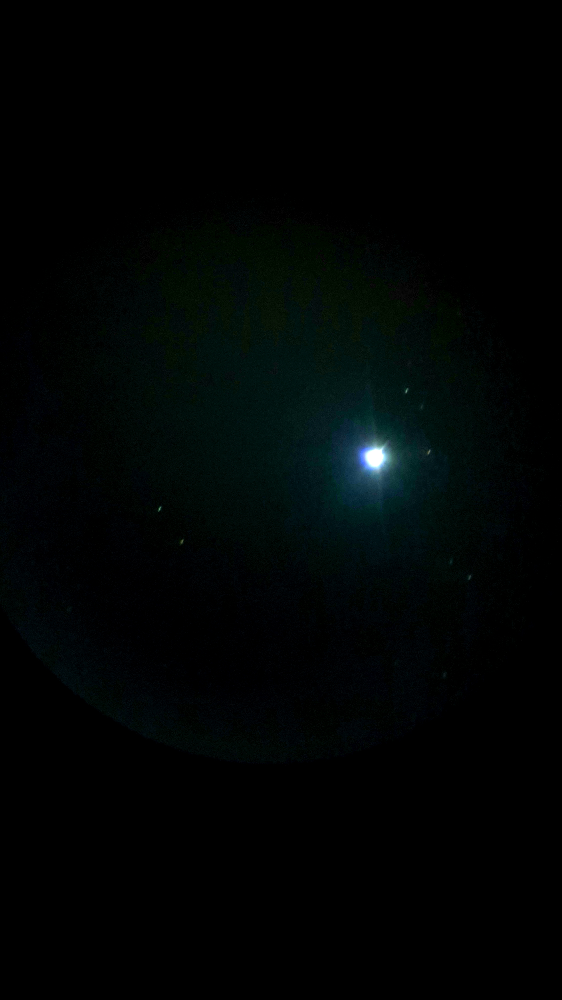
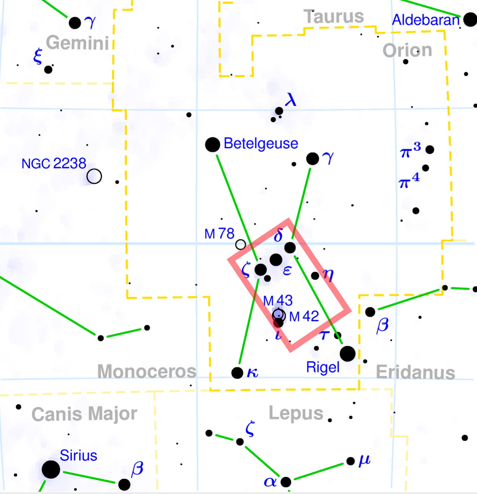

## Here are some pics clicked from the office roof-top

### The Moon        

   

### Venus     

      
     
### Jupiter and the Galilean moons: Io, Europa, Ganymede and Callisto       
    

### Sirius      

  

### Orion    
    

### Orion Nebula    
   

### ISS     

       
 
### Assorted   
   
