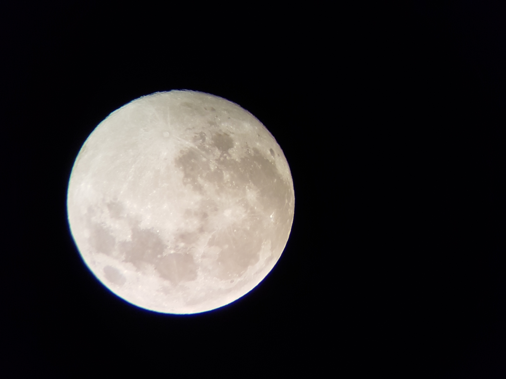
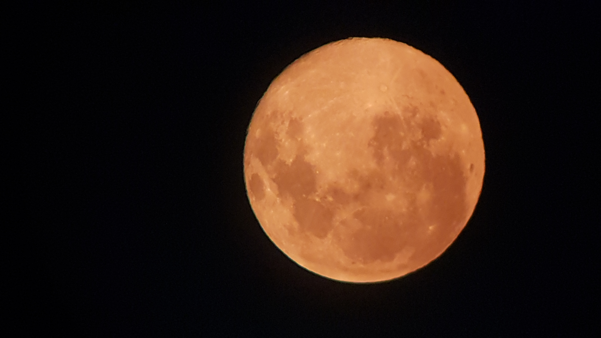
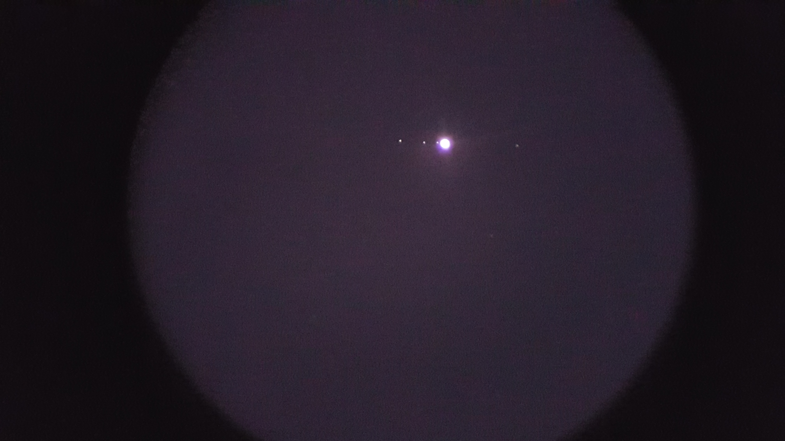
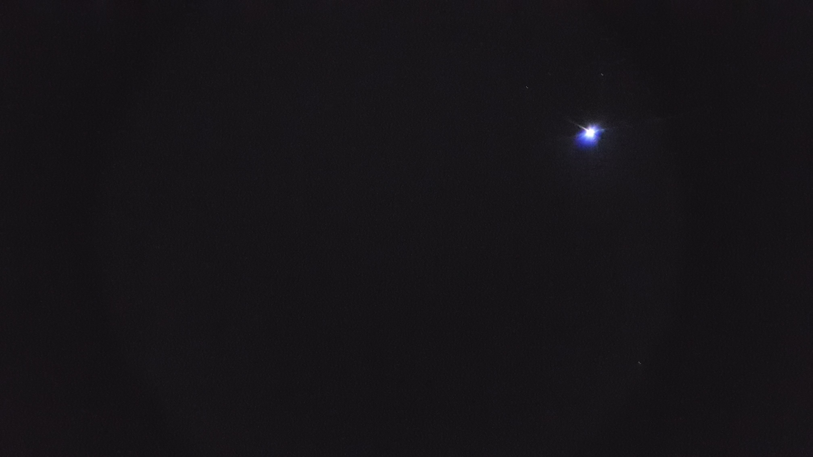

## Our office roof top offers a great view of the sky. Here are some pics clicked from there.

The Moon        

   
     
Jupiter and the Galilean moons: Io, Europa, Ganymede and Callisto       
    

 Sirus      

  

Orion    
  

Orion Nebula    

   
 
Assorted   
   
