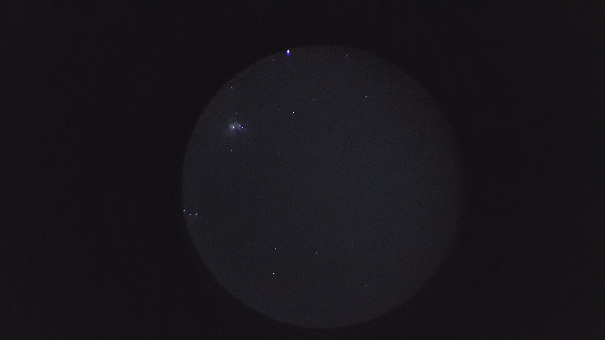
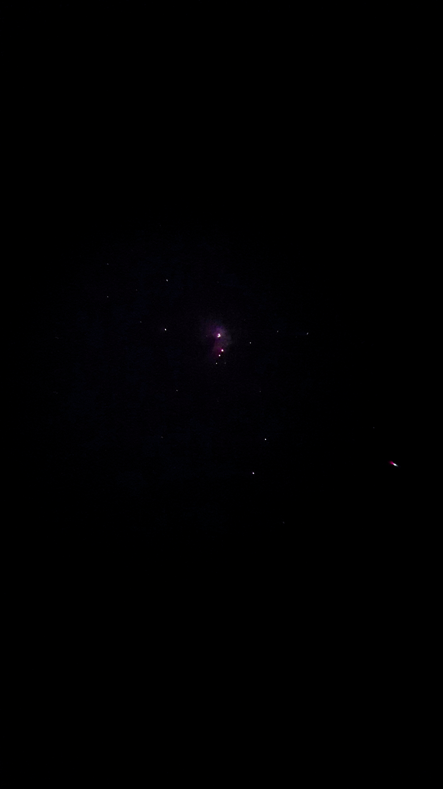

## Our office roof top is a nice place to spend the evening. It is calm out there and at night offers a great view of the sky. Here are some pics clicked from there.

The Moon        

   
     
Jupiter and the Galilean moons: Io, Europa, Ganymede and Callisto       
    

 Sirus      
     
  

   
   
 
   
