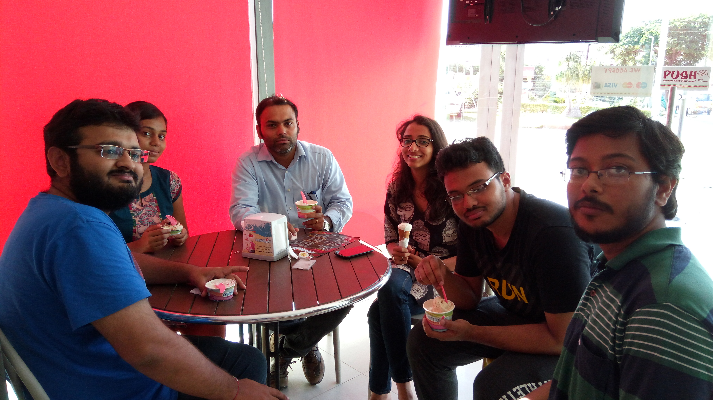
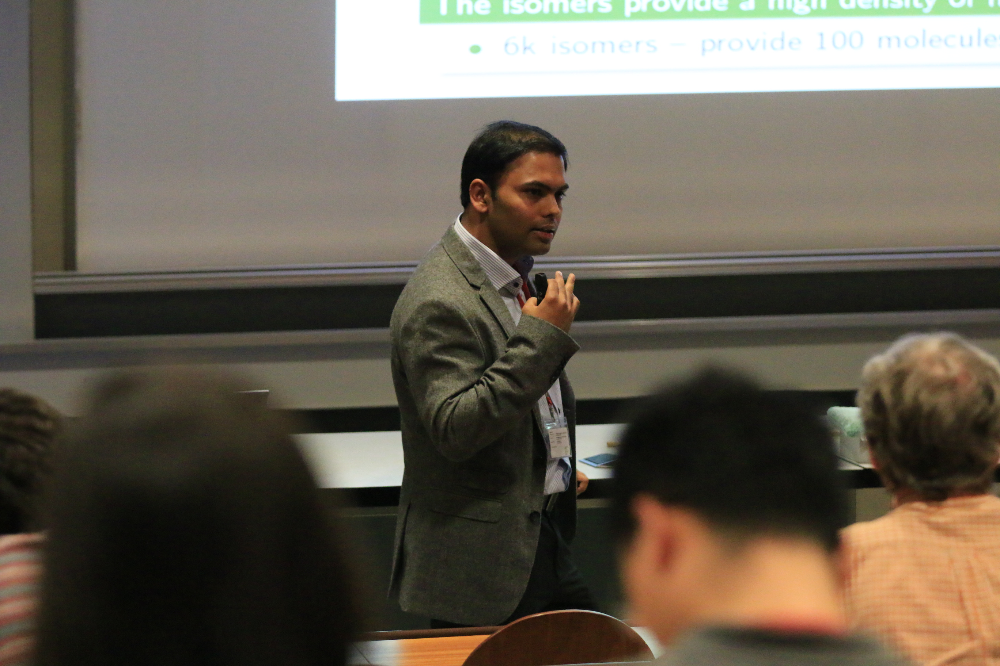
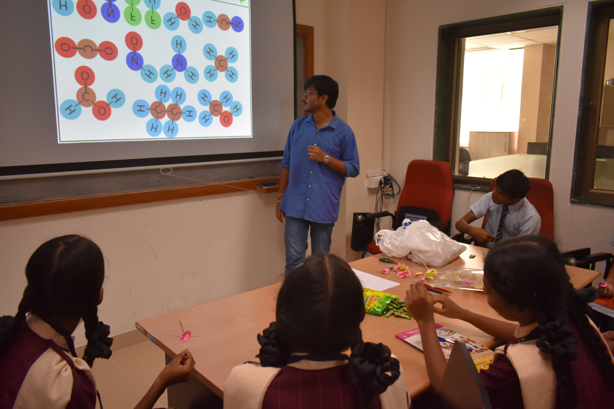
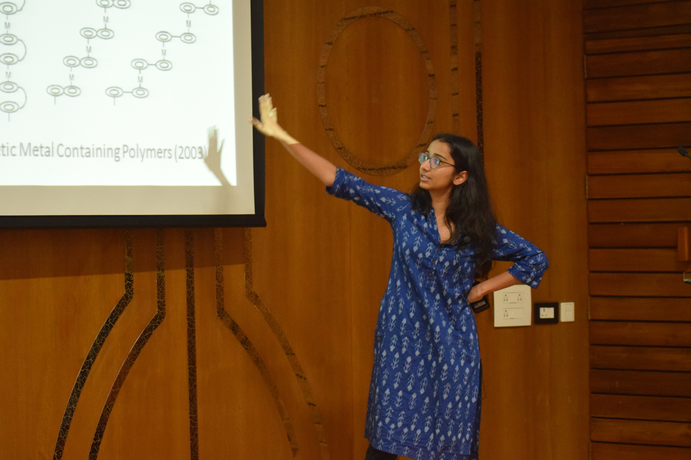
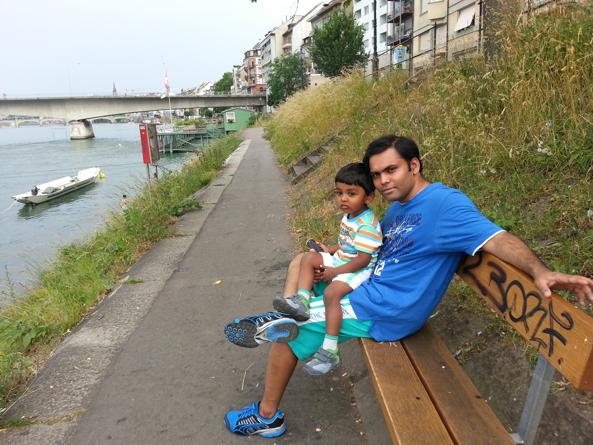

## The group

     

 

## The group presenting science

 

## The PI before the PI days

 
## Group Trips    

#### 4-5 December 2021, Explorations in Telangana    
Hyderabad-Ramappa Lake-Pandavula Gutta (mini Trek)-Ramappa Lake (Overnight stay)-Medaram Museum-Tadvai forest (Explore megalithic burials)-Hyderabad   

Who's high?      

      
 

Hardy brothers' pose   

  

The Lake      

    
 

Lost in Translation  
  
  

Three Burials in the Tadwai forest
  
 

When the PI takes a power nap!    

  

