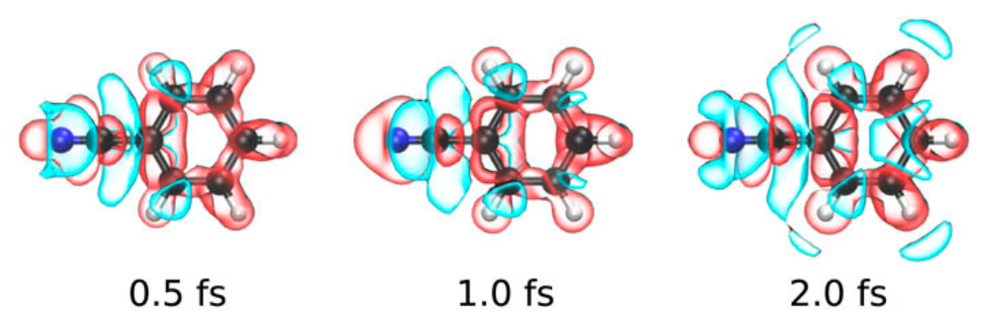
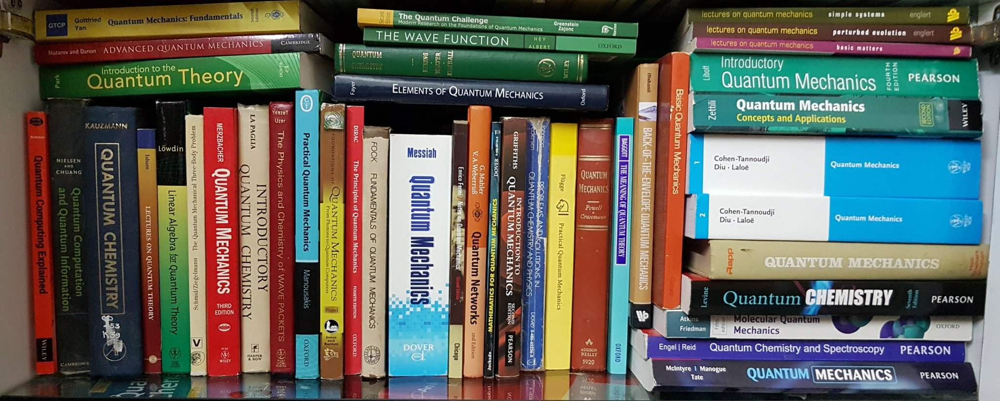

Our official website is here: [https://www.tifrh.res.in/~ramakrishnan/](https://www.tifrh.res.in/~ramakrishnan/)     

## Laboratory for Chemical Space Design and Data Science    
We are a small interdisciplinary team at the [Tata Institute of Fundamental Research Hyderabad, India](https://www.tifrh.res.in/). Topics of interest to us, in no particular order of preference, are Chemical compound space design, Quantum mechanics, Machine learning and Big Data analytics, Computational materials science, High-performance computing, Density functional theory, Femtosecond electron dynamics, Anharmonic vibrational spectra, Potential energy surfaces, and Computer-based science education. Our present research activities are largely driven by the requirements of our MolDis initiative.

### Project MolDis
MolDis, our big data analytics platform for MOLecular DIScovery is now open for public access. Please click the logo below for more details.

### Research tools
Our work depends on high-performance computation.        

               
We use several quantum chemistry and materials modeling software developed by research groups across the world.    

<!--

We have developed an _inhouse_ code for studying attosecond--to--femtosecond electronic processes.     

     
      
We apply kernel-based Quantum Machine Learning using the QML code and our own _inhouse_ codes.     

       
We have access to journals and books relevant to our research.           

-->
* * *

